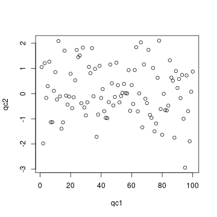
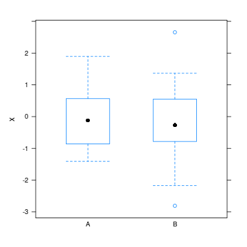

Quality control report generated with `qcmetrics`
===========================================


Author: 

Date: Thu Nov 26 17:39:30 2020


Metadata
-----------------------------

- **name** Prof. Who
- **lab** Big lab
- **uni** Cabin University


My test QcMetric
-------------------------


```
## Object of class "QcMetric"
##  Name: My test QcMetric 
##  Description:
## This qc metric describes bla bla bla, indicating possible issues in the
## third step of protocol bla bla bla.
##  Status: FALSE 
##  Data: qc1 qc2
```

My other metric
-------------------------


```
## Object of class "QcMetric"
##  Name: My other metric 
##  Status: TRUE 
##  Data: k x
```

```
## Loading required package: lattice
```


QC summary
-----------------------------

<!-- html table generated in R 4.1.0 by xtable 1.8-4 package -->
<!-- Thu Nov 26 17:39:30 2020 -->
<table border=1>
<tr> <th>  </th> <th> name </th> <th> status </th>  </tr>
  <tr> <td align="right"> 1 </td> <td> My test QcMetric </td> <td> FALSE </td> </tr>
  <tr> <td align="right"> 2 </td> <td> My other metric </td> <td> TRUE </td> </tr>
   </table>

Session information
-------------------------


```
## R Under development (unstable) (2020-11-18 r79449)
## Platform: x86_64-pc-linux-gnu (64-bit)
## Running under: Ubuntu 20.04.1 LTS
## 
## Matrix products: default
## BLAS/LAPACK: /usr/lib/x86_64-linux-gnu/openblas-pthread/libopenblasp-r0.3.8.so
## 
## locale:
##  [1] LC_CTYPE=en_US.UTF-8       LC_NUMERIC=C              
##  [3] LC_TIME=en_US.UTF-8        LC_COLLATE=en_US.UTF-8    
##  [5] LC_MONETARY=en_US.UTF-8    LC_MESSAGES=C             
##  [7] LC_PAPER=en_US.UTF-8       LC_NAME=C                 
##  [9] LC_ADDRESS=C               LC_TELEPHONE=C            
## [11] LC_MEASUREMENT=en_US.UTF-8 LC_IDENTIFICATION=C       
## 
## attached base packages:
## [1] stats4    parallel  stats     graphics  grDevices utils     datasets 
## [8] methods   base     
## 
## other attached packages:
##  [1] lattice_0.20-41     MSnbase_2.17.2      ProtGenerics_1.23.1
##  [4] S4Vectors_0.29.3    mzR_2.25.1          Rcpp_1.0.5         
##  [7] Biobase_2.51.0      BiocGenerics_0.37.0 qcmetrics_1.29.1   
## [10] BiocManager_1.30.10
## 
## loaded via a namespace (and not attached):
##  [1] httr_1.4.2            vsn_3.59.0            foreach_1.5.1        
##  [4] assertthat_0.2.1      highr_0.8             affy_1.69.0          
##  [7] pander_0.6.3          yaml_2.2.1            impute_1.65.0        
## [10] pillar_1.4.7          glue_1.4.2            limma_3.47.1         
## [13] digest_0.6.27         colorspace_2.0-0      htmltools_0.5.0      
## [16] preprocessCore_1.53.0 plyr_1.8.6            MALDIquant_1.19.3    
## [19] XML_3.99-0.5          pkgconfig_2.0.3       zlibbioc_1.37.0      
## [22] purrr_0.3.4           xtable_1.8-4          scales_1.1.1         
## [25] processx_3.4.4        whisker_0.4           affyio_1.61.0        
## [28] downlit_0.2.1         BiocParallel_1.25.1   tibble_3.0.4         
## [31] IRanges_2.25.2        ggplot2_3.3.2         ellipsis_0.3.1       
## [34] withr_2.3.0           magrittr_2.0.1        crayon_1.3.4         
## [37] memoise_1.1.0         evaluate_0.14         ps_1.4.0             
## [40] fs_1.5.0              ncdf4_1.17            fansi_0.4.1          
## [43] doParallel_1.0.16     MASS_7.3-53           xml2_1.3.2           
## [46] textshaping_0.2.1     tools_4.1.0           lifecycle_0.2.0      
## [49] stringr_1.4.0         munsell_0.5.0         callr_3.5.1          
## [52] pcaMethods_1.83.0     compiler_4.1.0        pkgdown_1.6.1.9000   
## [55] mzID_1.29.0           systemfonts_0.3.2     rlang_0.4.9          
## [58] grid_4.1.0            iterators_1.0.13      rstudioapi_0.13      
## [61] rmarkdown_2.5         gtable_0.3.0          codetools_0.2-18     
## [64] curl_4.3              rematch2_2.1.2        R6_2.5.0             
## [67] knitr_1.30            rprojroot_2.0.2       ragg_0.4.0           
## [70] desc_1.2.0            stringi_1.5.3         vctrs_0.3.5          
## [73] xfun_0.19
```
