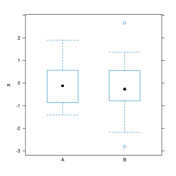

Quality control report generated with `qcmetrics`
===========================================


Author: 

Date: Sun Aug  1 15:29:12 2021


Metadata
-----------------------------

- **name** Prof. Who
- **lab** Big lab
- **uni** Cabin University


My test QcMetric
-------------------------


```
## Object of class "QcMetric"
##  Name: My test QcMetric 
##  Description:
## This qc metric describes bla bla bla, indicating possible issues in the
## third step of protocol bla bla bla.
##  Status: FALSE 
##  Data: qc1 qc2
```

My other metric
-------------------------


```
## Object of class "QcMetric"
##  Name: My other metric 
##  Status: TRUE 
##  Data: k x
```

```
## Loading required package: lattice
```


QC summary
-----------------------------

<!-- html table generated in R 4.1.0 by xtable 1.8-4 package -->
<!-- Sun Aug  1 15:29:12 2021 -->
<table border=1>
<tr> <th>  </th> <th> name </th> <th> status </th>  </tr>
  <tr> <td align="right"> 1 </td> <td> My test QcMetric </td> <td> FALSE </td> </tr>
  <tr> <td align="right"> 2 </td> <td> My other metric </td> <td> TRUE </td> </tr>
   </table>

Session information
-------------------------


```
## R version 4.1.0 (2021-05-18)
## Platform: x86_64-pc-linux-gnu (64-bit)
## Running under: Ubuntu 20.04.2 LTS
## 
## Matrix products: default
## BLAS/LAPACK: /usr/lib/x86_64-linux-gnu/openblas-pthread/libopenblasp-r0.3.8.so
## 
## locale:
##  [1] LC_CTYPE=en_US.UTF-8       LC_NUMERIC=C              
##  [3] LC_TIME=en_US.UTF-8        LC_COLLATE=C              
##  [5] LC_MONETARY=en_US.UTF-8    LC_MESSAGES=C             
##  [7] LC_PAPER=en_US.UTF-8       LC_NAME=C                 
##  [9] LC_ADDRESS=C               LC_TELEPHONE=C            
## [11] LC_MEASUREMENT=en_US.UTF-8 LC_IDENTIFICATION=C       
## 
## attached base packages:
## [1] stats4    stats     graphics  grDevices utils     datasets  methods  
## [8] base     
## 
## other attached packages:
## [1] lattice_0.20-44     MSnbase_2.19.1      ProtGenerics_1.25.1
## [4] S4Vectors_0.31.0    mzR_2.27.1          Rcpp_1.0.7         
## [7] Biobase_2.53.0      BiocGenerics_0.39.1 qcmetrics_1.31.1   
## 
## loaded via a namespace (and not attached):
##  [1] httr_1.4.2            vsn_3.61.2            foreach_1.5.1        
##  [4] highr_0.9             BiocManager_1.30.16   affy_1.71.0          
##  [7] pander_0.6.4          yaml_2.2.1            impute_1.67.0        
## [10] pillar_1.6.2          limma_3.49.1          glue_1.4.2           
## [13] digest_0.6.27         colorspace_2.0-2      preprocessCore_1.55.2
## [16] htmltools_0.5.1.1     plyr_1.8.6            MALDIquant_1.20      
## [19] XML_3.99-0.6          pkgconfig_2.0.3       zlibbioc_1.39.0      
## [22] purrr_0.3.4           xtable_1.8-4          scales_1.1.1         
## [25] processx_3.5.2        whisker_0.4           affyio_1.63.1        
## [28] downlit_0.2.1.9000    BiocParallel_1.27.2   tibble_3.1.3         
## [31] IRanges_2.27.0        ggplot2_3.3.5         ellipsis_0.3.2       
## [34] cachem_1.0.5          withr_2.4.2           cli_3.0.1            
## [37] magrittr_2.0.1        crayon_1.4.1          memoise_2.0.0        
## [40] evaluate_0.14         ps_1.6.0              fs_1.5.0             
## [43] ncdf4_1.17            fansi_0.5.0           doParallel_1.0.16    
## [46] MASS_7.3-54           xml2_1.3.2            textshaping_0.3.5    
## [49] tools_4.1.0           lifecycle_1.0.0       stringr_1.4.0        
## [52] munsell_0.5.0         cluster_2.1.2         callr_3.7.0          
## [55] pcaMethods_1.85.0     compiler_4.1.0        pkgdown_1.6.1.9001   
## [58] mzID_1.31.0           systemfonts_1.0.2     rlang_0.4.11         
## [61] grid_4.1.0            iterators_1.0.13      rstudioapi_0.13      
## [64] MsCoreUtils_1.5.0     rmarkdown_2.9         gtable_0.3.0         
## [67] codetools_0.2-18      curl_4.3.2            R6_2.5.0             
## [70] knitr_1.33            fastmap_1.1.0         utf8_1.2.2           
## [73] clue_0.3-59           rprojroot_2.0.2       ragg_1.1.3           
## [76] desc_1.3.0            stringi_1.7.3         parallel_4.1.0       
## [79] vctrs_0.3.8           xfun_0.24
```
