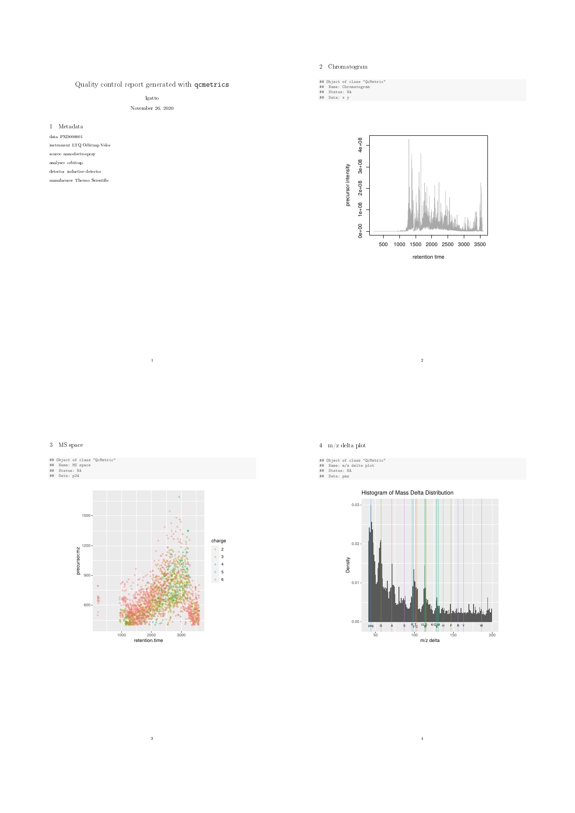
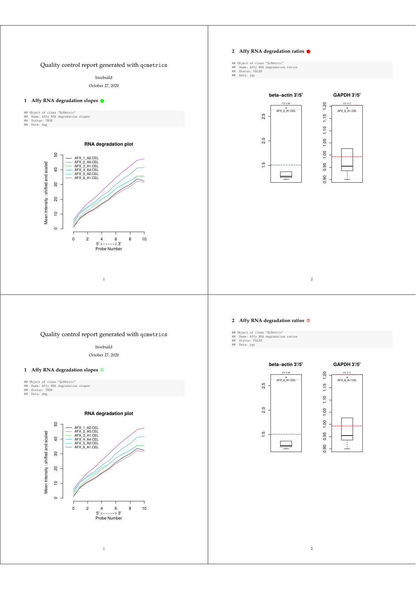

```{r env, include=FALSE, echo=FALSE, cache=FALSE}
suppressPackageStartupMessages(library("qcmetrics"))
suppressPackageStartupMessages(library("mzR"))
suppressPackageStartupMessages(library("MSnbase"))
set.seed(1)
```


# Introduction {#sec:intro}

Quality control (QC) is an essential step in any analytical
process. Data of poor quality can at best lead to the absence of
positive results or, much worse, false positives that stem from
uncaught faulty and noisy data and much wasted resources in pursuing
red herrings.

Quality is often a relative concept that depends on the nature of the
biological sample, the experimental settings, the analytical process
and other factors. Research and development in the area of QC has
generally lead to two types of work being disseminated. Firstly, the
comparison of samples of variable quality and the identification of
metrics that correlate with the quality of the data. These quality
metrics could then, in later experiments, be used to assess their
quality. Secondly, the design of domain-specific software to
facilitate the collection, visualisation and interpretation of various
QC metrics is also an area that has seen much development. QC is a
prime example where standardisation and automation are of great
benefit. While a great variety of QC metrics, software and pipelines
have been described for any assay commonly used in modern biology, we
present here a different tool for QC, whose main features are
flexibility and versatility. The `qcmetrics` package is a general
framework for QC that can accommodate any type of data. It provides a
flexible framework to implement QC items that store relevant QC
metrics with a specific visualisation mechanism. These individual
items can be bundled into higher level QC containers that can be
readily used to generate reports in various formats. As a result, it
becomes easy to develop complete custom pipelines from scratch and
automate the generation of reports. The pipelines can be easily
updated to accommodate new QC items of better visualisation
techniques.

Section \@ref(sec:qcclasses) provides an overview of the framework. In
section \@ref(sec:pipeline), we use proteomics data (subsection
\@ref(sec:prot)) to demonstrate the elaboration of QC pipelines: how
to create individual QC objects, how to bundle them to create sets of
QC metrics and how to generate reports in multiple formats. We also
show how the above steps can be fully automated through simple wrapper
functions. Although kept simple in the interest of time and space,
these examples are meaningful and relevant. In section
\@ref(sec:report), we provide more detail about the report generation
process, how reports can be customised and how new exports can be
contributed. We proceed in section \@ref(sec:qcpkg) to the
consolidation of QC pipelines using R and elaborate on the development
of dedicated QC packages with `qcmetrics`.

# The QC classes {#sec:qcclasses}

The package provides two types of QC containers. The `QcMetric` class
stores data and visualisation functions for single metrics. Several
such metrics can be bundled into `QcMetrics` instances, that can be
used as input for automated report generation. Below, we will provide
a quick overview of how to create respective `QcMetric` and
`QcMetrics` instances. More details are available in the corresponding
documentations.

## The `QcMetric` class

A QC metric is composed of a description (`name` in the code chunk
below), some QC data (`qcdata`) and a `status` that defines if the
metric is deemed of acceptable quality (coded as `TRUE`), bad quality
(coded as `FALSE`) or not yet evaluated (coded as `NA`). Individual
metrics can be displayed as a short textual summary or plotted. To do
the former, one can use the default `show` method.

```{r qcmetric}
library("qcmetrics")
qc <- QcMetric(name = "A test metric")
qcdata(qc, "x") <- rnorm(100)
qcdata(qc) ## all available qcdata
summary(qcdata(qc, "x")) ## get x
show(qc) ## or just qc
status(qc) <- TRUE
qc
```

Plotting `QcMetric` instances requires to implement a plotting method
that is relevant to the data at hand. We can use a `plot` replacement
method to define our custom function. The code inside the `plot` uses
`qcdata` to extract the relevant QC data from `object` that is then
passed as argument to `plot` and uses the adequate visualisation to
present the QC data.


```{r qcmetricplot}
plot(qc)
plot(qc) <- function(object, ... ) boxplot(qcdata(object, "x"), ...)
plot(qc)
```

## The `QcMetrics` class

A `QcMetrics` object is essentially just a list of individual
\Robject{QcMetric} instances. It is also possible to set a list of
metadata variables to describe the source of the QC metrics. The
metadata can be passed as an `QcMetadata` object (the way it is stored
in the `QcMetrics` instance) or directly as a named `list`. The
`QcMetadata` is itself a `list` and can be accessed and set with
`metadata` or `mdata`. When accessed, it is returned and displayed as
a `list`.

```{r}
qcm <- QcMetrics(qcdata = list(qc))
qcm
metadata(qcm) <- list(author = "Prof. Who",
                      lab = "Big lab")
qcm
mdata(qcm)
```

The metadata can be updated with the same interface. If new named
items are passed, the metadata is updated by addition of the new
elements. If a named item is already present, its value gets updated.

```{r}
metadata(qcm) <- list(author = "Prof. Who",
                      lab = "Cabin lab",
                      University = "Universe-ity")
mdata(qcm)
```

The `QcMetrics` can then be passed to the `qcReport` method to
generate reports, as described in more details below.


# Creating QC pipelines {#sec:pipeline}

## Microarray degradation {#sec:marray}

The Microarray degradation section has been removed since the packages
it was depending on have been deprecated.

## Proteomics raw data {#sec:prot}

To illustrate a simple QC analysis for proteomics data, we will
download data set `PXD00001` from the ProteomeXchange repository in
the mzXML format [@Pedrioli:2004]. The MS2 spectra from that
mass-spectrometry run are then read into Rand stored as an `MSnExp`
experiment using the `readMSData` function from the `MSnbase` package
[@Gatto:2012].

```{r, eval = FALSE}
library("RforProteomics")
msfile <- getPXD000001mzXML()
library("MSnbase")
exp <- readMSData(msfile, verbose = FALSE)
```

In the interest of time, this code chunk has been pre-computed
and a subset (1 in 3) of the `exp` instance is distributed with
the package. The data is loaded with

```{r}
load(system.file("extdata/exp.rda", package = "qcmetrics"))
```

The `QcMetrics` will consist of 3 items, namely a chromatogram
constructed with the MS2 spectra precursor's intensities, a figure
illustrating the precursor charges in the MS space and an m/z delta
plot illustrating the suitability of MS2 spectra for identification
(see `?plotMzDelta` or [@Foster:2011]).

```{r protqc1}
qc1 <- QcMetric(name = "Chromatogram")
x <- rtime(exp)
y <- precursorIntensity(exp)
o <- order(x)
qcdata(qc1, "x") <- x[o]
qcdata(qc1, "y") <- y[o]
plot(qc1) <- function(object, ...)
    plot(qcdata(object, "x"),
         qcdata(object, "y"),
         col = "darkgrey", type ="l",
         xlab = "retention time",
         ylab = "precursor intensity")
```


```{r protqc2, cache = TRUE}
qc2 <- QcMetric(name = "MS space")
qcdata(qc2, "p2d") <- plot2d(exp, z = "charge", plot = FALSE)
plot(qc2) <- function(object) {
    require("ggplot2")
    print(qcdata(object, "p2d"))
}
```

```{r protqc3, cache = TRUE}
qc3 <- QcMetric(name = "m/z delta plot")
qcdata(qc3, "pmz") <- plotMzDelta(exp, plot = FALSE,
                                  verbose = FALSE)
plot(qc3) <- function(object)
    suppressWarnings(print(qcdata(object, "pmz")))
```

Note that we do not store the raw data in any of the above instances,
but always pre-compute the necessary data or plots that are then
stored as `qcdata`. If the raw data was to be needed in multiple
`QcMetric` instances, we could re-use the same `qcdata` *environment*
to avoid unnecessary copies using `qcdata(qc2) <- qcenv(qc1)` and
implement different views through custom `plot` methods.

Let's now combine the three items into a `QcMetrics` object, decorate
it with custom metadata using the MIAPE information from the `MSnExp`
object and generate a report.

```{r protqcm}
protqcm <- QcMetrics(qcdata = list(qc1, qc2, qc3))
metadata(protqcm) <- list(
    data = "PXD000001",
    instrument = experimentData(exp)@instrumentModel,
    source = experimentData(exp)@ionSource,
    analyser = experimentData(exp)@analyser,
    detector = experimentData(exp)@detectorType,
    manufacurer = experimentData(exp)@instrumentManufacturer)
```

<!-- Running this one with echoing so that the auxiliary files,  -->
<!-- in particular the figure directory does not get deleted, as  -->
<!-- it is also created and needed by the vignette itself. -->

```{r protreport0, echo = FALSE, message = FALSE, eval = FALSE}
qcReport(protqcm, reportname = "protqc", clean=FALSE, quiet=TRUE)
```

The status column of the summary table is empty as we have not set the
QC items statuses yet.

```{r protreport, eval = FALSE}
qcReport(protqcm, reportname = "protqc")
```


```{r, results='markup', out.width="100%", fig.align="center", fig.cap="Proteomics QC report", echo=FALSE}

```

The complete pdf report is available with:

```{r, eval = FALSE}
browseURL(example_reports("protqc"))
```


## Processed N15 labelling data {#sec:n15}

In this section, we describe a set of N15 metabolic labelling QC
metrics [@Krijgsveld:2003]. The data is a phospho-enriched N15
labelled *Arabidopsis thaliana* sample prepared as described in
[@Groen:2013]. The data was processed with in-house tools and is
available as an `MSnSet` instance. Briefly, MS2 spectra were search
with the Mascot engine and identification scores adjusted with Mascot
Percolator. Heavy and light pairs were then searched in the survey
scans and N15 incorporation was estimated based on the peptide
sequence and the isotopic envelope of the heavy member of the pair
(the `inc` feature variable). Heavy and light peptides isotopic
envelope areas were finally integrated to obtain unlabelled and N15
quantitation data. The `psm` object provides such data for PSMs
(peptide spectrum matches) with a posterior error probability < 0.05
that can be uniquely matched to proteins.

We first load the `MSnbase` package (required to support the `MSnSet`
data structure) and example data that is distributed with the
`qcmetrics` package. We will make use of the `ggplot2` plotting
package.


```{r n15ex}
library("ggplot2")
library("MSnbase")
data(n15psm)
psm
```

The first QC item examines the N15 incorporation rate, available in
the `inc` feature variable. We also defined a median incorporation
rate threshold `tr` equal to 97.5 that is used to set the QC status.

```{r qcinc}
## incorporation rate QC metric
qcinc <- QcMetric(name = "15N incorporation rate")
qcdata(qcinc, "inc") <- fData(psm)$inc
qcdata(qcinc, "tr") <- 97.5
status(qcinc) <- median(qcdata(qcinc, "inc")) > qcdata(qcinc, "tr")
```

Next, we implement a custom `show` method, that prints 5 summary
values of the variable's distribution.

```{r qcinc2}
show(qcinc) <- function(object) {
    qcshow(object, qcdata = FALSE)
    cat(" QC threshold:", qcdata(object, "tr"), "\n")
    cat(" Incorporation rate\n")
    print(summary(qcdata(object, "inc")))
    invisible(NULL)
}
```


We then define the metric's `plot` function that represent the
distribution of the PSM's incorporation rates as a boxplot, shows all
the individual rates as jittered dots and represents the `tr`
threshold as a dotted red line.

```{r qcinc3}
plot(qcinc) <- function(object) {
    inc <- qcdata(object, "inc")
    tr <- qcdata(object, "tr")
    lab <- "Incorporation rate"
    dd <- data.frame(inc = qcdata(qcinc, "inc"))
    p <- ggplot(dd, aes(factor(""), inc)) +
        geom_jitter(colour = "#4582B370", size = 3) +
    geom_boxplot(fill = "#FFFFFFD0", colour = "#000000",
                 outlier.size = 0) +
    geom_hline(yintercept = tr, colour = "red",
               linetype = "dotted", size = 1) +
    labs(x = "", y = "Incorporation rate")
    p
}
```

N15 experiments of good quality are characterised by high
incorporation rates, which allow to deconvolute the heavy and light
peptide isotopic envelopes and accurate quantification.

The second metric inspects the log2 fold-changes of the PSMs, unique
peptides with modifications, unique peptide sequences (not taking
modifications into account) and proteins. These respective data sets
are computed with the `combineFeatures` function (see
`?combineFeatures` for details).

```{r combinefeatures}
fData(psm)$modseq <- ## pep seq + PTM
    paste(fData(psm)$Peptide_Sequence,
          fData(psm)$Variable_Modifications, sep = "+")
pep <- combineFeatures(psm,
                       as.character(fData(psm)$Peptide_Sequence),
                       "median", verbose = FALSE)
modpep <- combineFeatures(psm,
                          fData(psm)$modseq,
                          "median", verbose = FALSE)
prot <- combineFeatures(psm,
                        as.character(fData(psm)$Protein_Accession),
                        "median", verbose = FALSE)
```

The log2 fold-changes for all the features are then computed and
stored as QC data of our next QC item. We also store a pair of values
`explfc` that defined an interval in which we expect our median PSM
log2 fold-change to be.

```{r qclfc}
## calculate log fold-change
qclfc <- QcMetric(name = "Log2 fold-changes")
qcdata(qclfc, "lfc.psm") <-
    log2(exprs(psm)[,"unlabelled"] / exprs(psm)[, "N15"])
qcdata(qclfc, "lfc.pep") <-
    log2(exprs(pep)[,"unlabelled"] / exprs(pep)[, "N15"])
qcdata(qclfc, "lfc.modpep") <-
    log2(exprs(modpep)[,"unlabelled"] / exprs(modpep)[, "N15"])
qcdata(qclfc, "lfc.prot") <-
    log2(exprs(prot)[,"unlabelled"] / exprs(prot)[, "N15"])
qcdata(qclfc, "explfc") <- c(-0.5, 0.5)

status(qclfc) <-
    median(qcdata(qclfc, "lfc.psm")) > qcdata(qclfc, "explfc")[1] &
    median(qcdata(qclfc, "lfc.psm")) < qcdata(qclfc, "explfc")[2]
```

As previously, we provide a custom `show` method that displays summary
values for the four fold-changes. The `plot` function illustrates the
respective log2 fold-change densities and the expected median PSM
fold-change range (red rectangle). The expected 0 log2 fold-change is
shown as a dotted black vertical line and the observed median PSM
value is shown as a blue dashed line.

```{r qclfc2}
show(qclfc) <- function(object) {
    qcshow(object, qcdata = FALSE) ## default
    cat(" QC thresholds:", qcdata(object, "explfc"), "\n")
    cat(" * PSM log2 fold-changes\n")
    print(summary(qcdata(object, "lfc.psm")))
    cat(" * Modified peptide log2 fold-changes\n")
    print(summary(qcdata(object, "lfc.modpep")))
    cat(" * Peptide log2 fold-changes\n")
    print(summary(qcdata(object, "lfc.pep")))
    cat(" * Protein log2 fold-changes\n")
    print(summary(qcdata(object, "lfc.prot")))
    invisible(NULL)
}
plot(qclfc) <- function(object) {
    x <- qcdata(object, "explfc")
    plot(density(qcdata(object, "lfc.psm")),
         main = "", sub = "", col = "red",
         ylab = "", lwd = 2,
         xlab = expression(log[2]~fold-change))
    lines(density(qcdata(object, "lfc.modpep")),
          col = "steelblue", lwd = 2)
    lines(density(qcdata(object, "lfc.pep")),
          col = "blue", lwd = 2)
    lines(density(qcdata(object, "lfc.prot")),
          col = "orange")
    abline(h = 0, col = "grey")
    abline(v = 0, lty = "dotted")
    rect(x[1], -1, x[2], 1, col = "#EE000030",
         border = NA)
    abline(v = median(qcdata(object, "lfc.psm")),
           lty = "dashed", col = "blue")
    legend("topright",
           c("PSM", "Peptides", "Modified peptides", "Proteins"),
           col = c("red", "steelblue", "blue", "orange"), lwd = 2,
           bty = "n")
}
```

A good quality experiment is expected to have a tight distribution
centred around 0. Major deviations would indicate incomplete
incorporation, errors in the respective amounts of light and heavy
material used, and a wide distribution would reflect large variability
in the data.

Our last QC item inspects the number of features that have been
identified in the experiment. We also investigate how many peptides
(with or without considering the modification) have been observed at
the PSM level and the number of unique peptides per protein. Here, we
do not specify any expected values as the number of observed features
is experiment specific; the QC status is left as `NA`.


```{r qcnb}
## number of features
qcnb <- QcMetric(name = "Number of features")
qcdata(qcnb, "count") <- c(
    PSM = nrow(psm),
    ModPep = nrow(modpep),
    Pep = nrow(pep),
    Prot = nrow(prot))
qcdata(qcnb, "peptab") <-
    table(fData(psm)$Peptide_Sequence)
qcdata(qcnb, "modpeptab") <-
    table(fData(psm)$modseq)
qcdata(qcnb, "upep.per.prot") <-
    fData(psm)$Number_Of_Unique_Peptides
```

The counts are displayed by the new `show` and plotted as bar charts
by the `plot` methods.


```{r qcnb2}
show(qcnb) <- function(object) {
    qcshow(object, qcdata = FALSE)
    print(qcdata(object, "count"))
}
plot(qcnb) <- function(object) {
    par(mar = c(5, 4, 2, 1))
    layout(matrix(c(1, 2, 1, 3, 1, 4), ncol = 3))
    barplot(qcdata(object, "count"), horiz = TRUE, las = 2)
    barplot(table(qcdata(object, "modpeptab")),
            xlab = "Modified peptides")
    barplot(table(qcdata(object, "peptab")),
            xlab = "Peptides")
    barplot(table(qcdata(object, "upep.per.prot")),
            xlab = "Unique peptides per protein ")
}
```


In the code chunk below, we combine the 3 QC items into a `QcMetrics`
instance and generate a report using meta data extracted from the
`psm` `MSnSet` instance.

```{r n15qcm}
n15qcm <- QcMetrics(qcdata = list(qcinc, qclfc, qcnb))
```


```{r n15report, eval = FALSE}
qcReport(n15qcm, reportname = "n15qcreport",
         title = expinfo(experimentData(psm))["title"],
         author = expinfo(experimentData(psm))["contact"],
         clean = FALSE)
```

Once an appropriate set of quality metrics has been identified, the
generation of the `QcMetrics` instances can be wrapped up for
automation.

We provide such a wrapper function for this examples: the `n15qc`
function fully automates the above pipeline. The names of the feature
variable columns and the thresholds for the two first QC items are
provided as arguments. In case no report name is given, a custom title
with date and time is used, to avoid overwriting existing reports.

```{r, results='markup', out.width="100%", fig.align="center", fig.cap="N15 QC report", echo=FALSE}
knitr::include_graphics("./figs/n15qcreport.png")
```

The complete pdf report is available with

```{r, eval = FALSE}
browseURL(example_reports("n15qc"))
```

# Report generation {#sec:report}


The report generation is handled by dedicated packages, in particular
`knitr` [@Xie:2013] and `markdown` [@markdown].

## Custom reports


<!-- ### Templates -->

<!-- It is possible to customise reports for any of the existing types. The -->
<!-- generation of the pdf report is based on a `tex` template, -->
<!-- `knitr-template.Rnw`, that is available with the package (you can find -->
<!-- it with `system.file("templates", "knitr-template.Rnw", package = -->
<!-- "qcmetrics")`). The `qcReport` method accepts the path to a custom -->
<!-- `template` as argument. -->

<!-- The template corresponds to a LaTeX preamble with the inclusion of two -->
<!-- variables that are passed to the `qcReport` and used to customise the -->
<!-- template: the author's name and the title of the report. The former is -->
<!-- defaulted to the system username with `Sys.getenv("USER")` and the -->
<!-- later is a simple character. The `qcReport` function also -->
<!-- automatically generates summary and session information sections. The -->
<!-- core of the QC report, i.e the sections corresponding the the -->
<!-- individual `QcMetric` instances bundled in a `QcMetrics` input -->
<!-- (described in more details below) is then inserted into the template -->
<!-- and weaved, or more specifically `knit`'ted into a tex document that -->
<!-- is (if `type=pdf`) compiled into a pdf document. -->

<!-- The generation of the html report is enabled by the creation of a R -->
<!-- markdown file (Rmd) that is then converted with `knitr` and `markdown` -->
<!-- into html. The Rmd syntax being much simpler, no Rmd template is -->
<!-- needed. It is possible to customise the final html output by providing -->
<!-- a css definition as `template` argument when calling `qcReport`. -->

### QcMetric sections

The generation of the sections for `QcMetric` instances is controlled
by a function passed to the `qcto` argument. This function takes care
of transforming an instance of class `QcMetric` into a character that
can be inserted into the report. For the tex and pdf reports, `Qc2Tex`
is used; the Rmd and html reports make use of Qc2Rmd. These functions
take an instance of class `QcMetrics` and the index of the `QcMetric`
to be converted.

```{r Qc2Tex}
qcmetrics:::Qc2Tex
qcmetrics:::Qc2Tex(n15qcm, 1)
```

Let's investigate how to customise these sections depending on the
`QcMetric` status, the goal being to highlight positive QC results
(i.e. when the status is `TRUE`) with green circles (or smileys),
negative results with red cirlces (or frownies) and use en empty black
circle if status is `NA` after the section title (the respective
symbols are from the LaTeX package `wasysym`).


```{rQc2Tex2}
Qc2Tex2
```

To use this specific sectioning code, we pass our new function as
`qcto` when generating the report. To generate smiley labels, use
`Qc2Tex3`.


```{r maqcreport4, eval = FALSE}
qcReport(n15qcm, reportname = "report", qcto = Qc2Tex2)
qcReport(n15qcm, reportname = "report", qcto = Qc2Tex3) ## for smiley/frowney
```


```{r, results='markup', out.width="100%", fig.cap="Customised QC report", echo=FALSE}

```

The complete pdf report is available with:

```{r, eval = FALSE}
browseURL(example_reports("custom"))
```


## New report types


A reporting function is a function that


- Converts the appropriate QC item sections (for example the
  `Qc2Tex2` function described above).

- Optionally includes the QC item sections into addition header and
  footer, either by writing these directly or by inserting the
  sections into an appropriate template. The reporting functions that
  are available in `qcmetrics` can be found in `?qcReport`:
  `reporting_tex` for type tex, `reporting\_pdf` for type `pdf`,
  ... These functions should use the same arguments as `qcReport`
  insofar as possible.

- Once written to a report source file, the final report type is
  generated. `knit` is used to convert the Rnw source to tex which is
  compiled into pdf using `tools::texi2pdf`. The Rmd content is
  directly written into a file which is knitted and converted to html
  using `knit2html` (which call `markdownTOHTML`).

New `reporting_abc` functions can be called directly or passed to
`qcReport` using the `reporter` argument.


## QC packages {#sec:qcpkg}

While the examples presented in section \@ref(sec:pipeline) are
flexible and fast ways to design QC pipeline prototypes, a more robust
mechanism is desirable for production pipelines. The R packaging
mechanism is ideally suited for this as it provides versioning,
documentation, unit testing and easy distribution and installation
facilities.

While the detailed description of package development is out of the
scope of this document, it is of interest to provide an overview of
the development of a QC package. Taking the wrapper function, it could
be used the create the package structure

```{r qcpkg0, eval=FALSE}
package.skeleton("N15QC", list = "n15qc")
```

The `DESCRIPTION` file would need to be updated. The packages
`qcmetrics`, and `MSnbas` would need to be specified as dependencies
in the `Imports:` line and imported in the `NAMESPACE` file. The
documentation file `N15QC/man/n15qc.Rd` and the (optional)
\texttt{N15QC/man/n15pq-packge.Rd} would need to be updated.
q

# Conclusions {#sec:ccl}

R and Bioconductor are well suited for the analysis of high throughput
biology data. They provide first class statistical routines, excellent
graph capabilities and an interface of choice to import and manipulate
various omics data, as demonstrated by the wealth of packages that
provide [functionalities for
QC](http://bioconductor.org/packages/release/BiocViews.html#___QualityControl).

The `qcmetrics` package is different than existing R packages and QC
systems in general. It proposes a unique domain-independent framework
to design QC pipelines and is thus suited for any use case. The
examples presented in this document illustrated the application of
`qcmetrics` on data containing single or multiple samples or
experimental runs from different technologies. It is also possible to
automate the generation of QC metrics for a set of repeated (and
growing) analyses of standard samples to establish *lab memory* types
of QC reports, that track a set of metrics for controlled standard
samples over time. It can be applied to raw data or processed data and
tailored to suite precise needs. The popularisation of integrative
approaches that combine multiple types of data in novel ways stresses
out the need for flexible QC development.

`qcmetrics` is a versatile software that allows rapid and easy QC
pipeline prototyping and development and supports straightforward
migration to production level systems through its well defined
packaging mechanism.


**Acknowledgements**: Many thanks to Arnoud Groen for providing the
N15 data and Andrzej Oles for helpful comments and suggestions about
the package and this document.

# Session information {#sec:sessionInfo}

All software and respective versions used to produce this document are
listed below.

```{r si}
sessionInfo()
```
# References
